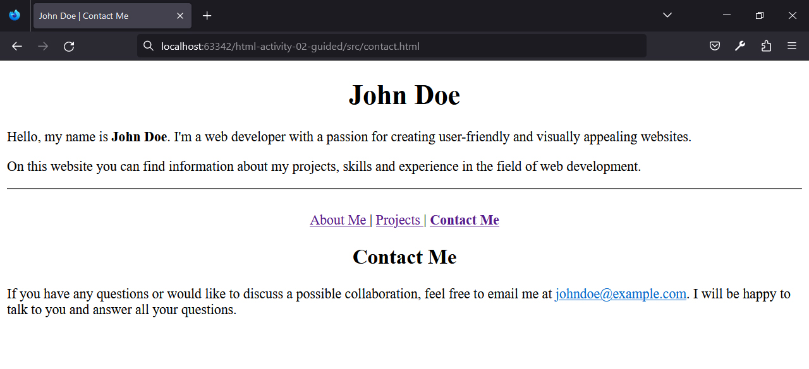

## HTML | Activity #2 (Guided): Attributes and Links
In this activity, we will create a website with three pages:

#### Page 1: About Me


#### Page 2: Projects


#### Page 3: Contact Me



### Development Setup
Create the following files inside the [**src**](/src) folder in this project:
1. `index.html`
2. `projects.html`
3. `contact.html`


### Page 1: About Me `[index.html]`
#### About Me | Intro
Let's create an HTML template in `index.html` and the introductory content that will appear on every page.
In this activity, we will use the `<div>` tag to group related elements.


We will center the title by setting the `align` attribute of the `<h1>` tag to `"center"`.
Then, we will bold the name in the paragraph using the `<b>` tag.
Finally, we will end the introduction section with a horizontal line defined by the `<hr/>` tag
and another blank line defined by the `<br/>` tag.

```html
<!DOCTYPE html>
<html lang="en">
<head>
    <meta charset="UTF-8">
    <title>John Doe | About Me</title>
</head>
<body>

    <div class="intro">
        <h1 align="center">John Doe</h1>
        <p>
            Hello, my name is <b>John Doe</b>.
            I'm a web developer with a passion for creating user-friendly and visually appealing websites.
        </p>
        <p>
            On this website you can find information about my projects, skills and experience in the field of web development.
        </p>
        
        <hr/>
        <br/>
    </div>

</body>
</html>
```

The `<div>` wrapper in this section has the `class` attribute set to `"intro"`.
The `class` attribute has nothing to do with the output for now,
but it will come in handy once we start integrating [CSS](https://www.w3schools.com/css).

#### About Me | Navigation
Right after the intro,
our website has a simple navigation system with page names displayed and the active page in bold.


Each link is defined by `<a>` tag with an `href` attribute set to the appropriate filename.
We will highlight the link of the **About Me** page using the `<b>` tag.

```html
    ...

    <div class="nav" align="center">
        <a href="index.html">
            <b>About Me</b>
        </a>
        |
        <a href="projects.html">
            Projects
        </a>
        |
        <a href="contact.html">
            Contact Me
        </a>
    </div>

</body>
</html>
```

The `<div>` wrapper in this section has the `class` attribute set to `"nav"`
and `align` attribute set to `"center"`.

#### About Me | Content
The main content of the **About Me** page consists of centered heading followed by left-aligned paragraph.


This heading is defined by an `<h2>` tag with its `align` attribute set to `"center"`.

```html
    ...

    <div class="content">
        <h2 align="center">About Me</h2>
        <p>
            I have many years of experience in front-end development using HTML, CSS and JavaScript.
            I enjoy working on both small projects and large web applications.
            My goal is to create beautiful and intuitive user interfaces that provide a great user experience.
        </p>
    </div>

</body>
</html>
```

The `<div>` wrapper in this section has the `class` attribute set to `"content"`.


### Page 2: Projects `[projects.html]`

We just need to copy the code from `index.html` to `projects.html`
and update the following parts in `projects.html`.
- Page Title
- Navigation
- Content

#### Projects | Page Title
We will replace the `<title>` element in `projects.html`.
```html
    ...

    <title>John Doe | Projects</title>

    ...
```

#### Projects | Navigation
In the navigation of `projects.html`, the link **Projects** is the only one highlighted in bold. 


To achieve this, the `<b>` tag must be set to the correct link text.

```html
    ...

    <div class="nav" align="center">
        <a href="index.html">
            About Me
        </a>
        |
        <a href="projects.html">
            <b>Projects</b>
        </a>
        |
        <a href="contact.html">
            Contact Me
        </a>
    </div>

    ...
```

#### Projects | Content
The content of project.html also follows the original format, but with different data:


This time, the `href` of the link is not within our site, but an external one.
We must provide the full
[URL](https://developer.mozilla.org/en-US/docs/Learn/Common_questions/Web_mechanics/What_is_a_URL)
of the link.
Also, in order for the link to open in another browser tab, its `target` attribute must be set to `"_blank"`.

```html
    ...

    <div class="content">
        <h2 align="center">Projects</h2>
        <p>
            Throughout my career, I have worked on a variety of projects ranging from personal websites to e-commerce platforms.
        </p>
        <p>
            My notable projects include developing responsive and mobile-friendly websites for local businesses to significantly improve their online presence and customer loyalty.
            You can see my projects in my <a href="https://github.com/johndoe" target="_blank">GitHub account</a>.
        </p>
    </div>

</body>
</html>
```


### Page 3: Contact Me `[contact.html]`

We just need to copy the code from `index.html` to `contact.html`
and update the following parts in `contact.html`.
- Page Title
- Navigation
- Content

#### Contact Me | Page Title
We will replace the `<title>` element in `contact.html`.
```html
    ...

    <title>John Doe | Contact Me</title>

    ...
```

#### Contact Me | Navigation
In the navigation of `contact.html`, the link **Contact Me** is the only one highlighted in bold.


To achieve this, the `<b>` tag must be set to the correct link text.

```html
    ...

    <div class="nav" align="center">
        <a href="index.html">
            About Me
        </a>
        |
        <a href="projects.html">
            Projects
        </a>
        |
        <a href="contact.html">
            <b>Contact Me</b>
        </a>
    </div>

    ...
```

#### Contact Me | Content
The content of project.html also follows the original format, but with different data:


This time, the href in the link is an email address, not a normal web URL.
To handle this, we will add `mailto:` at the beginning of the `href` attribute.

```html
    ...

    <div class="content">
        <h2 align="center">Contact Me</h2>
        <p>
            If you have any questions or would like to discuss a possible collaboration, feel free to email me at
            <a href="mailto:johndoe@example.com">johndoe@example.com</a>.
            I will be happy to talk to you and answer all your questions.
        </p>
    </div>

</body>
</html>
```
